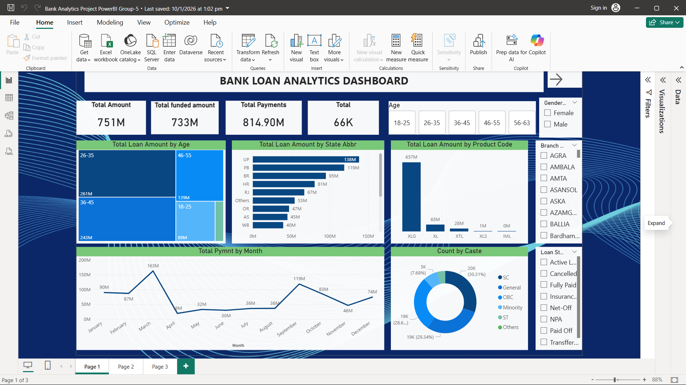

# Bank Analytics Project 

## Project Overview
This project provides a comprehensive analysis of bank loan performance, interest rates, and customer demographics. It focuses on tracking the health of the loan portfolio and regional disbursement trends across India.

## Tools Used
- **Excel** – Data cleaning, Pivot tables, and manual dashboarding
- **Power BI** – Interactive reporting and KPI tracking
- **Tableau** – Geospatial visualization and trend analysis
- **SQL** – Data Analysis

## Key KPIs
- **Total Loan Amount:** ₹751M
- **Total Funded Amount:** ₹733M
- **Average Interest Rate:** 12.03%
- **Total Payments Received:** ₹814.9M
- **Portfolio Status:** Major categories include Fully Paid, Active, and Net-Off

## Key Insights
- **Age Demographics:** Borrowers aged 26–45 represent the largest segment by loan volume.
- **Top Regions:** Uttar Pradesh (UP), Punjab (PB), and Rajasthan (RJ) are the top three states by funded amount.
- **Loan Grades:** The XLG grade carries the highest average interest rate (~12.14%) and significant loan value.
- **Gender Distribution:** Female customers account for a significantly higher portion of the loan amount compared to male customers.
- **Purpose:** Loan utilization is highest in the Services and Mobile Phones categories.

## Power BI Dashboard

### Page 1 – Financial Overview

### Page 2 – Customer Demographics

### Page 3 – Interest Rate & Grade Analysis

## Tableau Dashboard

